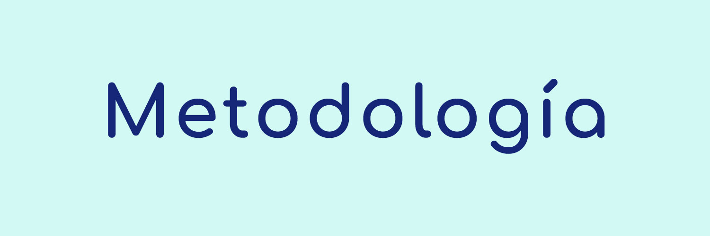

<h1 align="center"> Metodología de desarrollo del proyecto </h1>

`En este archivo encuentra la descripción del sistema de principios, técnicas y procedimientos definidos por el equipo de trabajo de datadiip para organizar y ejecutar las actividades del proyecto en mención.`
---

## Introducción

>En nuestro equipo, optamos por implementar una **metodología ágil**, donde el marco de trabajo principal será **Scrumban**, una combinación de Scrum y Kanban. Esta elección nos permite aprovechar la estructura de Scrum y el flujo de trabajo de Kanban que permite la **flexibilización de los roles de trabajo** y la limitación de **trabajo en progreso**.
>
> ### ¿Por qué metodología ágil y no tradicional?
> 
> > Esta elección se basa en la necesidad de **adaptabilidad**, **rapidez** y **comunicación** en un periodo de tiempo corto. Esta metodología nos permite:
> > 
> > 
> > 
> > #### Flexibilidad
> > 
> > > Responder rápidamente a los ajustes, solicitudes y retroalimentaciones del proyecto al establecer **fechas de entrega semanales** con el Product Owner.
> > 
> > #### Incrementalidad
> > 
> > > El producto se alimentará de varios **entregables semanales**, esto nos permite asegurar **productos mínimos viables** antes de finalizar cada semana que pueden ser evaluados por el Product Owner y ajustados antes del inicio del próximo sprint. 
> > 
> > #### Colaboración y comunicación de equipo
> > 
> > > Al trabajar en ciclos cortos y tener reuniones diarias, se mantiene a todo el **equipo informado** del progreso del proyecto, compartir ideas y resolver problemas de manera colaborativa.
> > 
> > #### Planeación semanal
> > 
> > > En este caso la planificación de las tareas se hace de manera **semanal**, un enfoque menos estricto y más realista en tiempo que el propuesto en las metodologías tradicionales, que permite asignar las tareas a las **necesidades** del proyecto semanal.
> 
> ### ¿Por qué SCRUMBAN?
> 
> > Este marco de trabajo es una combinación única de estructura y flexibilidad que nos permite aprovechar las ventajas de ambas metodologías con un un enfoque más **adaptable** y **menos estricto**.
> > 
> > 
> > 
> > #### Flexibilidad
> > 
> > > Ofrece la estructura y previsibilidad de **Scrum**, con sus iteraciones regulares y eventos definidos, junto con las prácticas flexibles, capacidad de respuesta y mejora continua de **Kanban**.
> > 
> > #### Adaptabilidad
> > 
> > > Nos permite **adaptar el proceso** a medida que evolucionan los sprints del proyecto, utilizar más prácticas de Scrum cuando se necesite mayor **planificación y estructura**, o Kanban, cuando se requiera mayor capacidad de **respuesta y flexibilidad**.
> > 
> > #### Gestión del flujo de trabajo
> > 
> > > El uso del tablero de Kanban permite **visualizar y controlar** el progreso de las tareas, y los **límites de trabajo** en progreso (WIP) ayudan a evitar el exceso de trabajo y los cuellos de botella.
> > 
> > #### Colaboración y transparencia
> > 
> > > Los tableros de progreso son **visibles para todos**, lo que facilita la comunicación y la colaboración en torno a las tareas y objetivos del proyecto.
---

## Ciclo de trabajo

> En cada uno de los sprints existen unas actividades predefinidas que marcan la organización del trabajo semanal
> 
> 
> ## Definición de requerimientos
> 
> > Se revisan las solicitudes del Product Owner, se establecen los objetivos de la semana y qué productos se van a entregar al finalizar el sprint.
> > 
> 
> ## Creación del backlog
> 
> > Se crean las tareas del equipo y se hace una planificación y asignación de estas tareas.
> > 
> 
> ## Ejecución del sprint
> 
> > Desarrollo de las tareas del sprint y seguimiento a través de reuniones diarias.
> > 
> 
> ## Presentación del sprint
> 
> > Se establece la presentación al Product Owner de los requerimientos de la semana.
> > 
> 
> ## Ajustes del sprint
> 
> > De acuerdo a la retroalimentación dada por el Product Owner se efectúan las correcciones antes del inicio del siguiente sprint.
> > 

# Roles

> La definición de roles nos permite orientar las actividades del grupo en función de las habilidades y experiencias previas del grupo, sin embargo la metodología escogida nos permite ejecutar estos roles de una manera menos estricta, en donde los roles se interpondrán a medida de las necesidades del proyecto.
> 
> 
> ## Roles metodológicos
> 
> ### Sprint moderator
> 
> > Cada semana cambia
> > 
> > 
> > Su rol está enfocado en dinamizar las reuniones diarias del grupo con el objetivo de priorizar la ejecución de tareas del grupo.
> > 
> > <aside>
> >  Revisa junto al grupo los obstáculos y buscan resolverlos.
> > 
> > </aside>
> > 
> > <aside>
> >  Crea las tareas que se realizarán en la semana en el tablero Kanban.
> > 
> > </aside>
> > 
> > <aside>
> >  Pregunta por la asignación de las tareas.
> > 
> > </aside>
> > 
> > <aside>
> >  Modera posibles desviaciones de los objetivos de las reuniones.
> > 
> > </aside>
> > 
> 
> ### Sprint team
> 
> > Todos los miembros del equipo ejecutan las tareas creadas.
> > 
> > 
> > <aside>
> >  Escogen sus tareas de acuerdo a sus habilidades y compromiso.
> > 
> > </aside>
> > 
> > <aside>
> >  Participan y proponen ideas en las reuniones del equipo
> > 
> > </aside>
> > 
> 
> ## Roles Data Science
> 
> ### Data Architect
> 
> > Diseña y gestiona la arquitectura de los datos para garantizar que se capturen, almacenen, procesen y utilicen de manera eficiente y efectiva.
> > 
> > 
> > <aside>
> >  Establece el plan para la estructura de los datos asegurando coherencia con los objetivos del proyecto.
> > 
> > </aside>
> > 
> > <aside>
> >  Desarrolla modelos y esquemas de los datos
> > 
> > </aside>
> > 
> > <aside>
> >  Diseña estrategias para integrar los datos de múltiples fuentes.
> > 
> > </aside>
> > 
> > <aside>
> >  Políticas de gobierno de datos.
> > 
> > </aside>
> > 
> 
> ### Data Analyst
> 
> > Extrae información significativa que pueda ayudar a la toma de decisiones y al logro de los objetivos organizacionales.
> > 
> > 
> > <aside>
> >  Usa técnicas y herramientas estadísticas para explorar los conjuntos de datos e identificar información.
> > 
> > </aside>
> > 
> > <aside>
> >  Limpia y prepara los datos para su análisis.
> > 
> > </aside>
> > 
> > <aside>
> >  Crea y presenta informes con el uso de herramientas de storytelling y visualización.
> > 
> > </aside>
> > 
> > <aside>
> >  Utiliza modelos de predicción para analizar resultados futuros.
> > 
> > </aside>
> > 
> 
> ### Data Engineer
> 
> > Diseña, construye y mantiene los sistemas y arquitecturas que permiten el procesamiento y análisis eficiente de grandes volúmenes de datos.
> > 
> > 
> > <aside>
> >  Crea y mantiene flujos de trabajo robustos y escalables que reúnan datos de diferentes fuentes y realicen un proceso de ETL.
> > 
> > </aside>
> > 
> > <aside>
> >  Integra datos de diferentes fuentes.
> > 
> > </aside>
> > 
> > <aside>
> >  Diseña, implementa y gestiona almacenes de datos de forma eficiente.
> > 
> > </aside>
> > 
> > <aside>
> >  Optimiza el rendimiento de los sistemas de datos mediante indexación y ajustes.
> > 
> > </aside>
> > 
> 
> ### Machine Learning Engineer
> 
> > Diseña, implementa y mantiene los sistemas de aprendizaje automático para realizar modelos de predicción.
> > 
> > 
> > <aside>
> >  Establece los conjuntos de datos que usará para entrenar los modelos de aprendizaje y normalizar para un mayor rendimiento.
> > 
> > </aside>
> > 
> > <aside>
> >  Diseña, implementa y evalúa modelos de aprendizaje automático.
> > 
> > </aside>
> > 
> > <aside>
> >  Ajusta y optimiza los hiperparámetros para mejorar el rendimiento y precisión del modelo.
> > 
> > </aside>
> > 
> > <aside>
> >  Implementa los modelos entrenados en APIs y servicios en la nube.
> > 
> > </aside>
> > 

# Eventos

> Se realiza una definición de las actividades que se van a desarrollar durante el desarrollo del proyecto.
> 
> 
> ## Sprints
> 
> > El desarrollo del proyecto se dividirá en Sprints con una semana de duración, inician los días Lunes y finalizan el día viernes con la presentación de los entregables de esta semana.
> > 
> > 
> > ### Sp1 -  Planeación y acercamiento
> > 
> > 25 | Marzo | 2024 → 29 | Marzo | 2024
> > 
> > > Se realiza todos los lunes y determina la ruta de trabajo de la semana.
> > > 
> > > 
> > > <aside>
> > >  Se revisan las tareas en el tablero Kanban.
> > > 
> > > </aside>
> > > 
> > > <aside>
> > >  Se dividen las tareas en función de las habilidades del equipo.
> > > 
> > > </aside>
> > > 
> > > <aside>
> > >  Se revisan los resultados de la retroalimentación (si la hay).
> > > 
> > > </aside>
> > > 
> 
> ## Reuniones
> 
> > Se presentan las diferentes reuniones que tendrá el equipo para comunicar sus avances, problemas y decidir el avance.
> > 
> > 
> > ### Sprint Planning
> > 
> > (30 minutos) 10AM 🇦🇷 | 8AM 🇨🇴
> > 
> > > Se realiza todos los lunes y determina la ruta de trabajo de la semana.
> > > 
> > > 
> > > <aside>
> > >  Se revisan las tareas en el tablero Kanban.
> > > 
> > > </aside>
> > > 
> > > <aside>
> > >  Se dividen las tareas en función de las habilidades del equipo.
> > > 
> > > </aside>
> > > 
> > > <aside>
> > >  Se revisan los resultados de la retroalimentación (si la hay).
> > > 
> > > </aside>
> > > 
> > 
> > ### Daily Scrum (15 minutos) 10AM 🇦🇷 | 8AM 🇨🇴
> > 
> > > Reunión de actualización de los avances de Martes a Jueves.
> > > 
> > > 
> > > <aside>
> > >  Cada integrante muestra lo que realizó el día anterior y lo que realizará en el día.
> > > 
> > > </aside>
> > > 
> > > <aside>
> > >  Se informa si existen dificultades de avance.
> > > 
> > > </aside>
> > > 
> > > <aside>
> > >  Se determina como se solucionarán los obstáculos.
> > > 
> > > </aside>
> > > 
> > > <aside>
> > >  Se determina los avances que se mostrarán al mentor y las dudas.
> > > 
> > > </aside>
> > > 
> > 
> > ### Sprint Review (15 minutos) 2PM 🇦🇷 | 12MM 🇨🇴
> > 
> > > Reunión con el mentor asignado.
> > > 
> > > 
> > > <aside>
> > >  Se presentan las dudas y avances del proyecto.
> > > 
> > > </aside>
> > > 
> > 
> > ### Sprint Demo
> > 
> > > Reunión con el Product Owner los días viernes.
> > > 
> > > 
> > > <aside>
> > >  Se presentan los resultados del trabajo de la semana.
> > > 
> > > </aside>
> > > 
> > > <aside>
> > >  Se anotan los comentarios de la retroalimentación del product owner.
> > > 
> > > </aside>
> > > 
> > 
> > ### Sprint Feedback (15 minutos)
> > 
> > > Reunión posterior a la reunión con el Product Owner los días viernes.
> > > 
> > > 
> > > <aside>
> > >  Se revisan los comentarios de la retroalimentación del product owner.
> > > 
> > > </aside>
> > > 
> > > <aside>
> > >  Se establecen tareas para corregir los aspectos de la retroalimentación antes de la reunión de inicio Sprint.
> > > 
> > > </aside>
> > > 
> > 
> > ### Sprint Support
> > 
> > > Reuniones de apoyo determinadas por el equipo para:
> > > 
> > > 
> > > <aside>
> > >  Resolver dudas.
> > > 
> > > </aside>
> > > 
> > > <aside>
> > >  Comunicar algún problema.
> > > 
> > > </aside>
> > > 
> 
> ## Tools
> 
> > Se establecen las herramientas necesarias para la organización del trabajo y la comunicación.
> > 
> > 
> > ### Sprint Backlog
> > 
> > Semanal
> > 
> > > Es una lista de todas las tareas que el equipo se compromete a realizar durante el sprint.
> > > 
> > > 
> > > <aside>
> > >  Puede aumentar en función del tamaño de las tareas.
> > > 
> > > </aside>
> > > 
> > 
> > ### Kanban board
> > 
> > Tablero que muestra el flujo de trabajo de las tareas del sprint.
> > 
> > > Contiene los elementos del Sprint Backlog.
> > > 
> > > 
> > > <aside>
> > >  Organizados en etapas de su progreso.
> > > 
> > > </aside>
> > > 

